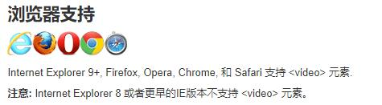

# HTML5

## 1.辅助知识

### 1.1 细说HTML5
* 5怎么来？HTML第五次重大修改，改变的地方就是有了些新的标签，属性，和行为。

### 1.2 广义上HTML5
* 1.语义化标签，媒体标签，表单属性，
* 2.三维，css3特性，
* 3.本地存储，新的JS

### 1.3 为什么学？如何学？
* 为什么学？
* 1.移动端的火热（趋势），PC端IE9以下不兼容。
* 2.旋转，等形状的酷炫变化；多媒体的一些视频，音频，以前的HTML实现较为吃力（flash费劲）
* 如何学？基础班XHTML没有完全放弃，所以，我们只需要注意H5新的变化特性；

## 2.代码知识
* 多敲多练，浏览器敲不坏
* 不要死记硬背，看见什么知道代表什么就可以；

### 2.1 语义化标签
* 语义化：语义化是对谁？对搜索引擎说，就知道我们写的标签里会出现什么样的内容。更好的识别我们写的东西。

* 有哪些：
```
header
nav 
section 块级标签，大DIV
```

* 特点：
* 1.新标签，和DIV一样。多次使用。
* 2.欢迎在移动端使用，PC低版本不支持（IE8可以测试下，IE9 需要转块级元素：小米官网base.css）；


### 2.2 多媒体标签  音频 audio

* 直接写：
```
<audio src="media/snow.mp3" controls="controls"></audio>
```

* 支持情况：


* 兼容写法：（页面执行的时候，从上到下一个一个执行，遇见哪个能用就用哪个）
```
<audio controls="controls">
    <source src="media/snow.mp3" type="audio/mpeg" />
    <source src="media/snow.ogg" type="audio/ogg" />
    <source src="media/snow.wav" type="audio/wav" />
        您的浏览器不支持播放声音（IE678）
</audio>
```

* 属性：
```
【audio】
controls:控件，各家浏览器的控件的样式不同；
loop:开启循环播放；
autoplay：自动播放（谷歌是不允许自动播放的，用户体验）

【source】
src：
type：audio/mpeg   audio/ogg   audio/wav
```

### 2.3 多媒体标签  视频 video

* 直接写：
```
<video src="media/video.mp4" controls="controls"></video>
```

* 支持情况：



* 兼容写法：
```
<video muted="muted" loop="loop" poster="media/pig.jpg" controls>
    <source src="media/video.mp4" type="video/mp4" />
    <source src="media/video.ogg" type="video/ogg" />
    您的浏览器太low了，不支持播放此视频
</video>
```

* 属性：
```
【video】
controls:控件
loop：是否开启循环播放
autoplay：自动播放 （谷歌浏览器禁用自动。IE没问题）
muted：是否静音播放。（muted=muted解决谷歌浏览器禁用自动播发，就是静音播发。）
poster：poster="media/pig.jpg"就是第一帧的画面，不自动播放的时候。

```

### 2.4 新增表单类型

* 以前：
```
<form action="">
    <ul>
        <li>邮箱: <input type="text" /></li>
        <li> <input type="submit" value="提交"></li>
    </ul>
</form>
```

* 现在：
```
<form action="">
    <ul>
        <li>邮箱: <input type="email" /></li>
        <li>网址: <input type="url" /></li>
        <li>日期: <input type="date" /></li>
        <li>日期: <input type="time" /></li>
        <li>数量: <input type="number" /></li>
        <li>手机号码: <input type="tel" /></li>
        <li>搜索: <input type="search" /></li>
        <li>颜色: <input type="color" /></li>

        <li> <input type="submit" value="提交"></li>
    </ul>
</form>
```

* 特点：
* 1.提交的时候，不是当前类型，不能提交，有错误提醒；
* 2.手机端PC端显示的样式不一样，手机端调用的键盘不一样。number tel调用的就是数字键盘；
* 3.感受：对于我们来说，更人性化了，更方便了；
* 4.关注我们学会这些标签，先不要关注PC和移动端的样式不同。

### 2.5 新增表单 属性

* 属性


```
required：
placeholder：提示文本。引导用户些信息
autofocus：autofocus='autofocus' 自动回去焦点
autocomplete:先有name这个属性
multiple:可以多选文件上传
```

```
  <form action="">
    用户名:
    <input type="text" required="required" placeholder="请输入用户名" autofocus="autofocus" name="username" autocomplete="off">
     
    上传头像: <input type="file" name="" id="" multiple="multiple">

    <input type="submit" value="提交">
  </form>
```

## 3.面试知识

* 用没用过H5？新增标签（语义化、媒体标签、新的表单标签），新增的属性（那些标签上的一些属性的设置会导致不一样的效果）

## 4.总结：
* 1.控件样式不同：各家浏览器的样式不一样，说明浏览器也没有那么神奇，就是人写的东西，用于展示我们写的页面，有自己浏览器内置的一些样式；
* 2.新增的一些标签和属性，没有那么神奇，只是更人性化，对于程序员来说；


