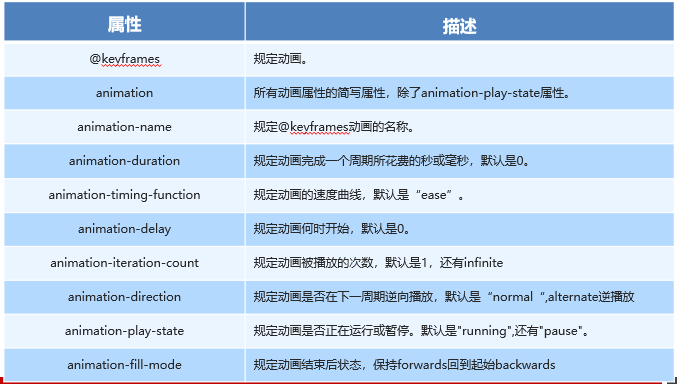
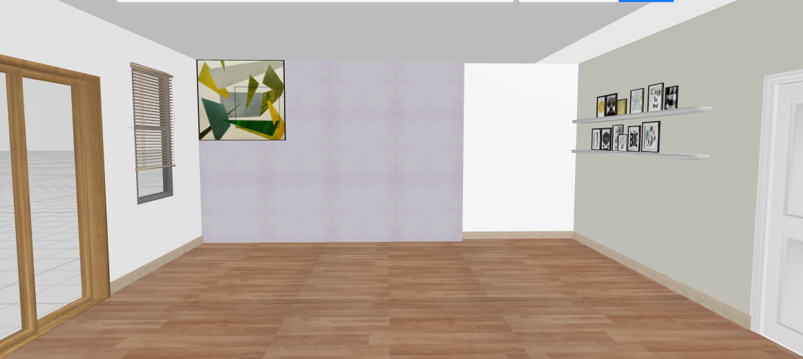
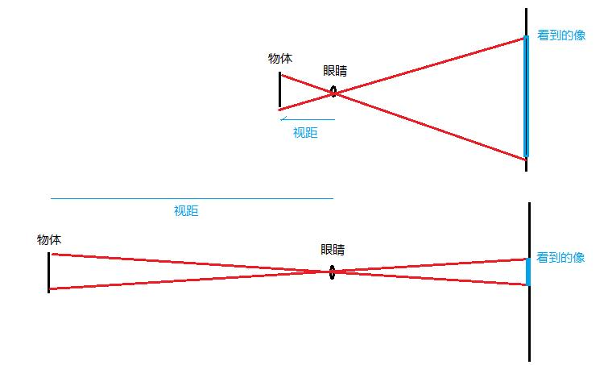
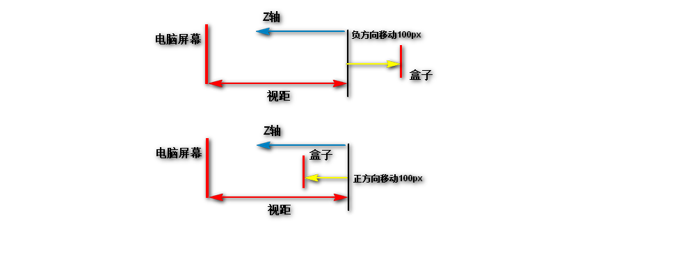
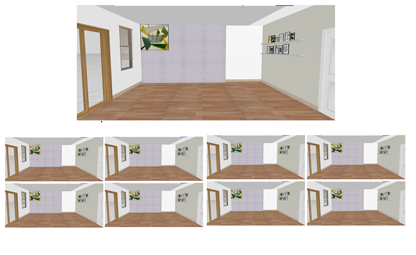
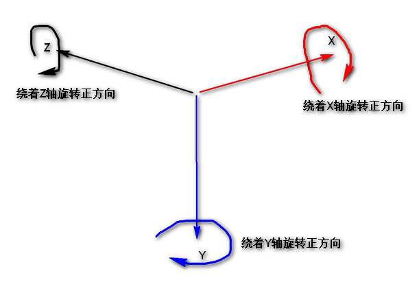
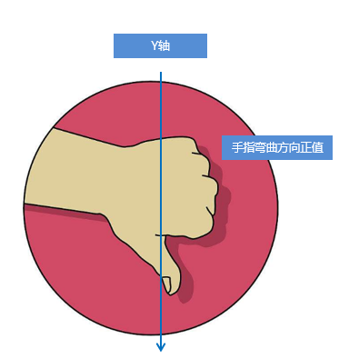

# day-01

* 在页面做2D、3D效果，页面表现更为丰富；
* 目标：
  * **2D：重点居中方案；**
  * animation：知道动画属性代表什么意见即可；
  * 3D：了解前端可以做一些3D业务；


# 2D转化

* 使元素旋转缩放等，页面表现丰富。配合动画做效果；

## 坐标系

* 2D：direction 方向 坐标系：


## 移动 translate

* 作用：可以改变元素在页面中的位置，类似**定位**；

* 语法：2D/3D转化 语法入口transform（转化）；

```css
/* 单个写*/
transform: translateX(100px);
transform: translateY(-50%);

/* 合起来写*/
transform: translate(100px,100px);

/* 百分数*/
transform: translate(50%, 50%);
```

* 与定位的区别：
  * 定位：
    * **会影响其他盒子位置（脱离标准流）；**
    * 行内元素定位，直接变为块级元素；
  * 移动：
    * **不影响其他元素的位置；**
    * 在行内元素无效；对块级元素生效；
  * 扩展：http://www.caotama.com/4285.html；

* **居中的解决方案：**不用关心被居中盒子本身的宽高是多少；


## 旋转 rotate

* 旋转使页面表现更为丰富

* 语法：单位是deg，正值顺时针。关键词：**绕着；**

```css
transform: rotate(45deg);
```

* 默认：为中心点旋转；

* 补充：伪元素

  * 为什么叫伪元素：页面HTML结构中没有元素，但是页面中却真实存在；

  * 常用：做小图标引用；字体图标引入，手动实现小图标；

  * 特点：

    * **content属性不能丢；**content:"";‘’；
    * 行内元素；
    * div::before:hover不能这样用；用法：div:hover::before
    * **伪元素只能用在双标签上使用；**单标签 img 不行；

    


## 中心点（了解）

* 改变中心点位置，2D转化（旋转、缩放）的效果不一样；

* 语法：默认旋转的基准点是中心点；50% 50%；

```css
/* 具体PX值*/
transform-origin:100px 100px;
/* 百分数*/
transform-origin:50% 50%;
/* 方位名词*/
transform-origin:left bottom;

/* 单个参数，第二个值默认为50%*/
transform-origin:0;
```


## 缩放 scale

* 场景：鼠标悬浮，按钮放大；

* 语法：后面的参数 为 倍数；（无单位）

```css
/* 长度、宽度方向 缩放 */
transform:scale(2,3);

/* 长度、宽度方向 缩放为同一个比例*/
transform:scale(2);
transform:scale(0.5);
```

* 注意：

  * 会受 中心点 影响；
  * **下面的子元素、文字、属性会被缩放；**

  


## 2D简写

* 单独多次写，不生效，下面的会把上面的层叠掉；

```
transform: translate(x,y);
transform: rotate(90deg);
```

* 更为简洁地综合起来写2D相关的属性；

```css
/* 移动在旋转前面 */
transform: translate(x,y) rotate(90deg) scale(x,y);

/* 旋转在前面 */
transform: rotate(90deg) translate(x,y) scale(x,y);
```

* **使用顺序不同，出现的效果不同，因为旋转会改变初始轴向，再次移动就会按照改变后的轴向进行移动；**


# animation 

- 动画 animation 是CSS3中具有**颠覆性**的特征之一，可通过设置一个元素在多个时间节点上的不同样式来达到一个动画的效果；
- 比过渡表现更为丰富；
- 语法：1定义；2调用；3.时间

```css
/* 1. 定义:*/帧
@keyframes dong_hua {
    /* 开始状态:*/
    from {
        transform: translateX(0px);
        background-color: red;
    }
    /* 结束状态 */
    to {
        transform: translateX(1000px);
        background-color: #222;
    }
}

div {
    /* 2. 调用:*/
    animation-name: move;
    
    /* 3. 时间:*/
    animation-duration: 3s;
}
```

- 状态：可以写2D转化，也可以写我们基础班学习的各种属性；


## 动画序列

- 时间节点，可以更为精准的控制动画的多个状态节点，动画的变化更为丰富；
- 语法：

```css
@keyframes name {
    /* 开始状态:*/
    from {
    }
    /* 结束状态 */
    to {
    }
}

@keyframes name {
    /* 开始状态:*/
    0% {
    }
    50% {
    }
    75% {
    }
    83% {
 
    }
    /* 结束状态 */
    100% {
    }
}
```

- 动画序列就是时间节点时的状态；
- n步变化，就需要n+1个节点；
- **动画从开始执行到经过动画节点，都是基于上一个状态进行变化；**


## 动画属性

- 丰富我们的动画特性，能做更多的属性控制；



- animation-timing-function：动画 运动 速度曲线：速度快慢的体现；

```css
div{
    /* 匀速  */
    animation-timing-function: linear;

    /* 慢-快-慢  默认值  */
    animation-timing-function: ease;

    /* 慢-快  */
    animation-timing-function: ease-in;

    /* 快-慢  */
    animation-timing-function: ease-out;

    /* 慢-快-慢  */
    animation-timing-function: ease-in-out;
}
```

- animation-timing-function：steps(n)  分步 实现 老电影一帧一帧，整个动画分为几步骤完成

```css
/* 分步 实现 老电影一帧一帧，整个动画分为几步骤完成*/
animation-timing-function: steps(n);
```

- animation-delay：动画推迟多久执行；动画得等待。
- animation-iteration-count：播放循坏次数 1 2  infinite  无限次 

```css
div{
    /* 指定次数设置  */
    animation-iteration-count: 2;

    /* 无限次数设置  */
    animation-iteration-count: infinite;
}
```

- animation-direction：循环方向：若0% 红色; 100% 黑色

```css
div{
    /*1 默认值 0-100 */
    animation-direction: normal;
    
    /*2 100-0 */
    animation-direction: reverse;
    
    /*3 0-100-0 最少要执行两次动画*/
    animation-direction: alternate;

    /*4 100-0-100 */
    animation-direction: alternate-reverse;
}
```

- animation-fill-mode：动画等待或者结束的状态设置；

```css
div{
    /*1 动画结束后，元素样式停留在 100% 的样式 */
    animation-fill-mode: forwards;
    
    /*2 在延迟等待的时间内，元素样式停留在 0% 的样式 
    动画结束的时候，回到div本身的样式（回到起始状态）
    */
    animation-fill-mode: backwards;
    
    /*3 同时设置了 forwards和backwards两个属性值
    在动画等待时间，样式为元素样式停留在 0% 的样式，
    动画结束时，元素样式停留在 100% 的样式
     */
    animation-fill-mode: both;
}
```

- animation-play-state：暂停和播放 鼠标控制 不常用

```css
div{
    /*1 播放 */
    animation-play-state: running;
    /*2 暂停*/
    animation-play-state: paused;
}
```

- 设置 animation-direction ，需设置动画 多次 执行；
- 设置 animation-fill-mode，不能设置 无限 执行；


## 简写

- 简单把动画属性写在一起，代码简单；vsc有提示；

- 简写：动画名称 持续时间 速度曲线 等待时间 执行次数 执行的方向 动画等待或结束的状态

```css
div{
    animation: name duration timing-function delay iteration-count direction fill-mode;
}
```

- 组动画：需要用 逗号 隔开；

```css
animation: name_1 5s linear,name_2 2s linear;
```

- animation-play-state 没有在简写内
- 记忆：知道意思即可，记不住去查就行；


## 案例分析步骤

- 目标：自己拿到需求，可以按照步骤进行分解动画步骤，最后满足业务需求；

### 步骤

- 布局：不要被动画干扰，先把动画屏蔽掉；
- 分析：
  - **几个动画时间节点？**
  - 节点设置？
  - 动画属性？
    - 一样的动画分析一个；
    - 连续动画和steps()动画？
    - 匀速变化？还是变速变化？
    - 执行多次？无限次？

### 重点

- 要坚持自己的想法，去实现；

### 案例

- 热点：
  - 底图：w:797px;h:616px;
  - 分析：
    - 动画节点：3个；
    - 节点设置：缩放？或者width 0-40-70?
    - 动画属性：等待？线性？


- 大白熊：
  - 盒子：宽高
  - 第一个动画：左侧移动到中间
  - 第二个动画：自己动
    - 节点：2个
    - 节点设置：背景图位置移动
    - 属性：分步


## 前缀（了解）

- 新特性，对各家浏览器更好的兼容，以便以后出了兼容问题，我们可以从这个方向想；

- -moz-：代表 firefox 浏览器私有属性
- -ms-：代表 ie 浏览器私有属性
- -webkit-：代表 safari、chrome 私有属性
- -o-：代表 Opera 私有属性

```css
-moz-border-radius: 10px; 
-webkit-border-radius: 10px; 
-o-border-radius: 10px; 
border-radius: 10px;
```

- 没有工程化工具，根据业务需要写这些前缀，解决样式的兼容；
- 有工程化工具，注意这些工具包的配置。webpack


# 3D

* 页面内可展示3D元素，让页面看起来更为丰富；

## 三维坐标系

* 理解3D空间的基础知识，我们生活的空间就是3D空间；

* 在2D基础坐标上，增加一条垂直屏幕向外的一个轴线Z轴正向；


* 线上体验：https://yun.kujiale.com


## 移动 translate3d

* 从2D到3D，多出来一个轴：Z轴，关注做Z轴方向的移动；

* 2D移动关键词：沿着；多个了Z轴进行移动；先体验XY轴移动，再去体验Z轴方向的移动；

```css
div {
    /* 单独分开写 使用1*/
    transform: translateX(100px);
    transform: translateY(-100px);
    transform: translateY(100%);
    transform: translateZ(100px);
    
    /* 写在一起*/
    transform: translateX(100px) translateY(100px) translateZ(100px);

    /* 三个方向同时写的简写 使用2*/
    transform: translate3d(100px,100px,100px);
    
}
```

* XY 方向可以设置px值和%（因为有宽高）；
* Z 轴只能设置 px，不能设置%（原因是盒子没有厚度）；


## 视距 perspective

* 开启立体空间的第一步；设置与被观测的物体的距离，有距离才会有近大远小的效果；

### 生活中近大远小

* 生活中中观测物体，会产生**近大远小；**美术中的**透视感**；



* 生活中近处大、远处小的原理（呈像与物体的关系）



### 语法

* 浏览器：拉开距离，保证盒子的移动能被观测到**近大远小的效果；**产生透视感

```css
perspective: 1000px;
```



* **观测角度：**不同的观测角度，透视感不同。涉及到加在谁上面？



* **值的设置：**变化的剧烈程度不一样；

```css
    /* 父元素 */
    body {
      perspective: 1000px;
    }

    /* 目标 */
    div {
      width: 200px;
      height: 200px;
      background-color: aqua;
      margin: 100px auto;
      /* z轴的移动 */
      transform: translateZ(0px);
    }
```

### 小结

- 作用？在浏览器中，产生**近大远小**，透视感；
- 类比生活：HTML元素盒子与屏幕直接的距离；（**呈像：屏幕**；物体：HTML元素盒子）；
- 加给谁？意味着站在哪个角度去观测
  - 加在body上，整个下面所有的元素产生统一近大远小的透视感；
  - 加在每个盒子的父亲上，即站在每个父亲的角度上进行观测，产生透视感；
- 值不同的效果？**观测到设置视距值不同，只是盒子近大远小的变化程度不一样；**
- 值如何设置？就是看业务需要多大的近大远小的效果，一般设置1000px左右，没有固定值；


## 旋转   rotate

* 2D旋转：平面内；3D旋转：空间；效果更为丰富；

* 2D旋转：关键词 绕着，正方向是在屏幕内顺时针方向；现在看来，就是绕着Z轴的旋转；
* 3D学习选择关注点：绕着谁？顺时针转？

### 左手工具

* 绕着轴，值为正，则顺时针旋转；



* **左手工具：**
  * 左手的手拇指指向 某一 轴的正方向；
  * 其余手指的弯曲方向就是该元素 绕着 某一 轴旋转的方向 为顺时针正方向；
  * **想方便的观测到如何旋转，要把轴向指向你的眼睛。**



### 语法

```css
img:hover {
   transform: rotateX(45deg);
   transform: rotateY(45deg);
   transform: rotateZ(-45deg);
}
```

* 自定义轴向：（了解即可）

```css
img:hover {
    /* 1, 1, 0为空间向量坐标 x y z */
    transform: rotate3d(1, 1, 0, 45deg);
}
```

* 关注：绕着谁？怎么为顺时针？
* **怎么找方向？左手工具一次只能绕着一个轴旋转；**


## 3D呈现  transform-style

- 子元素做3D转换，需在其父级上加transform-style属性，这样子元素做的3D转化才能为观测到；

* 语法：

```css
/* 设置在有子元素的父级上； */
/* 默认值：不开启*/
transform-style: flat;


/* 给子元素开启3D环境*/
transform-style: preserve-3d; 
```

- 与视距的区别从两个方面入手：**作用？**加给谁？
  - 视距perspective：
    - **近大远小**，透视感；
    - body(一般情况下)、各自父亲；观测角度不同；
  - 3D呈现：
    - **父亲给亲生子元素一个3D空间，子元素做3D转化可呈现出来；**
    - **上下级的父亲上加；**（你要做什么事情，得经过你父母的同意）；可能会加多个地方；


## 缩放 scale3d（了解）

* 可以让盒子在空间内缩放；

* 2D缩放：scale(2,3)  相对自身宽高进行缩放；


* 语法：

```css
/* 宽，高 缩放一倍，厚度放大两倍 */
transform: scale3d(1,1,2)

/* 宽 缩放 */
transform: scaleX(1);
/* 高 缩放 */
transform: scaleY(1);

/* 厚度 缩放？没有厚度 */
transform: scaleZ(1); 
```

* 特点：
  * 3D缩放，相对于自身宽高厚，Z轴缩放不生效，因为没有厚；
  * 下面子元素、文字、设置属性都会跟着缩放；


## 简写

* 语法：

```css
transform: translateY() rotateX();
```

* 案例：3D立方体；
* 注意：旋转会改变轴向，会影响效果；


